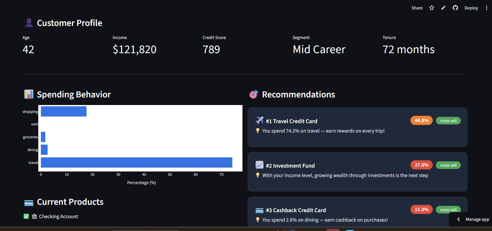
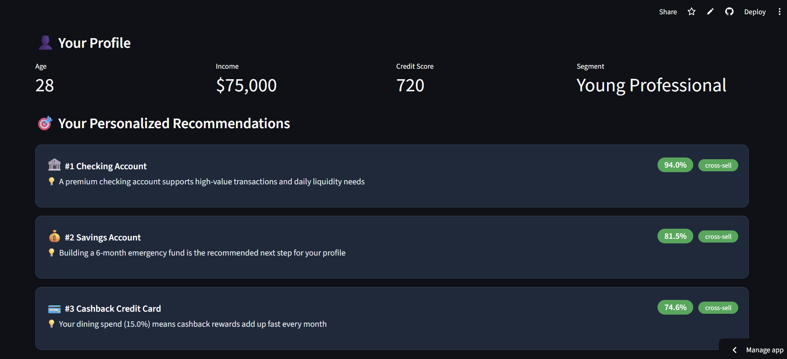

# 🏦 Fintech Product Recommender

> AI-powered banking product recommendation system built on enterprise-grade data infrastructure

🚀 **[Live Demo](https://fintech-recommender.streamlit.app)**

---

## 📌 Business Problem

Banks leave billions on the table through poor cross-selling. The average customer owns only **2.76 out of 8** available products — an **86.1% cross-sell gap**. This system uses ML to identify which products each customer is most likely to want next, with explainable reasons for every recommendation.

---

## 🎥 Demo

### Existing Customer Recommendations



### New Customer Profile



---

## 🏗️ Architecture

```
CSV Data → Snowflake Bronze → dbt Silver → dbt Gold → ML Models → FastAPI → Streamlit
```

---

## 🛠️ Tech Stack

| Layer               | Technology                                      |
| ------------------- | ----------------------------------------------- |
| Data Warehouse      | Snowflake                                       |
| Transformation      | dbt (Medallion Architecture)                    |
| Processing          | PySpark                                         |
| ML Models           | ALS Collaborative Filtering + Cosine Similarity |
| Experiment Tracking | MLflow                                          |
| API                 | FastAPI                                         |
| Frontend            | Streamlit                                       |
| Deployment          | Railway (API) + Streamlit Cloud (UI)            |

---

## 🤖 Models

### 1. ALS Collaborative Filtering (PySpark)

- Trained on **27,589** customer-product interactions
- Finds customers with similar ownership patterns
- Handles implicit feedback (owns/doesn't own)

### 2. Content-Based Filtering

- Uses **8 spending categories** as features
- Cosine similarity between customer profile and product profiles
- Solves the **cold start problem** for new customers

### 3. Hybrid Model

- Combines **ALS (40%) + Content-Based (40%) + Product Affinity (20%)**
- Segment-aware recommendations
- **Explainable AI** — every recommendation includes a human-readable reason

---

## 📊 Key Results

| Metric                    | Value   |
| ------------------------- | ------- |
| Customers profiled        | 10,000  |
| Transactions analyzed     | 300,123 |
| Cross-sell gap identified | 86.1%   |
| Recommendations generated | 30,000  |
| ML signals combined       | 3       |

---

## 🗄️ Data Pipeline

```
Bronze Layer  →  Raw data as-is (4 tables)
Silver Layer  →  Cleaned, typed, validated
Gold Layer    →  ML-ready features
                 ├── GOLD_CUSTOMER_FEATURES   (10K rows, 30 features)
                 ├── GOLD_USER_ITEM_MATRIX    (10K rows, 8 products)
                 ├── GOLD_PRODUCT_AFFINITY    (40 rows, segment insights)
                 └── HYBRID_RECOMMENDATIONS  (30K rows, final output)
```

---

## 🔌 API Endpoints

```
GET  /health                  → Health check
GET  /recommend/{customer_id} → Existing customer recommendations
POST /recommend/profile       → New customer recommendations
```

---

## 💡 Sample API Response

```json
{
  "customer_id": "C_00001",
  "profile": {
    "age": 22,
    "income": "$58,024",
    "segment": "Young Professional"
  },
  "recommendations": [
    {
      "rank": 1,
      "product": "Travel Credit Card",
      "emoji": "✈️",
      "score": 36.7,
      "type": "cross-sell",
      "reason": "You spend 59.6% on travel — earn rewards on every trip!"
    }
  ]
}
```

---

## 🚀 Quick Start

```bash
# Clone repo
git clone https://github.com/forampanchal/fintech-recommender
cd fintech-recommender

# Install dependencies
pip install -r requirements.txt

# Set up environment
cp .env.example .env
# Fill in your Snowflake credentials

# Run API locally
uvicorn api.main:app --reload

# Run Streamlit locally
streamlit run streamlit/app.py
```

---

## 📁 Project Structure

```
fintech-recommender/
├── data/               ← Synthetic data generation (300K transactions)
├── dbt/                ← Bronze/Silver/Gold transformations
│   └── models/
│       ├── bronze/     ← Source definitions
│       ├── silver/     ← Cleaned tables
│       └── gold/       ← ML-ready features
├── notebooks/          ← EDA + ML model development
│   ├── 01_eda.ipynb           ← 86.1% cross-sell gap analysis
│   ├── 02_als_model.ipynb     ← PySpark ALS collaborative filtering
│   ├── 03_content_based.ipynb ← Cosine similarity model
│   └── 04_hybrid_model.ipynb  ← Hybrid model + Snowflake upload
├── api/                ← FastAPI serving layer
│   └── main.py
├── streamlit/          ← Frontend UI
│   └── app.py
├── utils/              ← Snowflake connector
│   └── snowflake_connector.py
└── mlflow/             ← Experiment tracking
```

---

## 🧠 Key Design Decisions

**Why Hybrid Model?**
ALS struggles with new customers (cold start). Content-based struggles with surprising recommendations. Hybrid combines both strengths.

**Why Snowflake + dbt?**
Enterprise-grade data pipeline matching real bank infrastructure. Medallion architecture ensures data quality at each layer.

**Why Explainable AI?**
Financial recommendations require transparency. Each recommendation includes a human-readable reason based on the dominant signal.

---

## 👨‍💻 Author

**Foram Panchal**
MS Data Science @ Stevens Institute of Technology
[LinkedIn](https://linkedin.com/in/forampanchal1999) | [GitHub](https://github.com/forampanchal)
